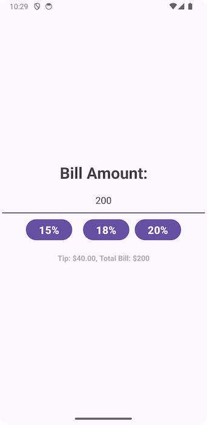

# VS-Tip-Calculator

## Description
Tip Calculator is a simple Android app that calculates the tip value based on the user input. The app has three buttons with 15%, 18%, and 20% values. As the user inputs the total bill amount and clicks the tip button, the app calculates the tip percentage of the total value and displays the details for the user. The app was developed on Android Studio in Java and Kotlin to generate Gradle scripts.

## Screenshots

### Homepage

### On 15% 

### On 18%

### On 20%

## License

  